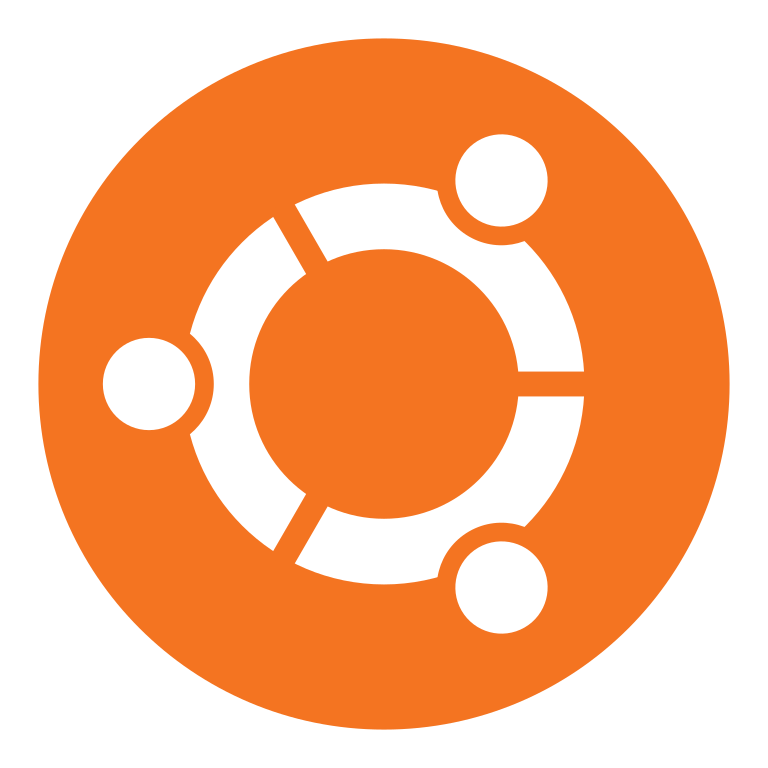

## Hi there, I'm Emeka!  👋 
## I am a Self-Taught Programmer and Masters Student in Artificial Intelligence at Monash University

### I'm Actively Looking For Career Opportunities (Focus: Python, Javascript, React.js, Java)

- 🌱 I’m working constantly on following my passion in becoming a programmer. My long-term goal is getting into ML/AI
- 👯 I’m looking to collaborate with other programmers & Devs
- ⚡ Fun facts: I'm a mixed martial artist who's strengths are in boxing and Muay Thai, I speak Spanish and Japanese, and I like to study the brain sciences!

### Join My Meetup Group "The Pair Programming Community"!

[][Meetup]
 
 

### Connect with me:

[][linkedin]

[][Twitter]

### Languages and Tools:

 
 

---

### 📕 Upcoming Blog Posts

<!-- BLOG-POST-LIST:START -->
- [##Not Currently Blogging##](https://emekaanekwe.com)

<!-- BLOG-POST-LIST:END -->

---

[website]: https://www.emekaanekwe.com
[linkedin]: https://www.linkedin.com/in/emeka-programmer
[Twitter]: https://www.twitter.com/EmekaIsCoding
[Meetup]: https://www.meetup.com/the-pair-programming-community/
